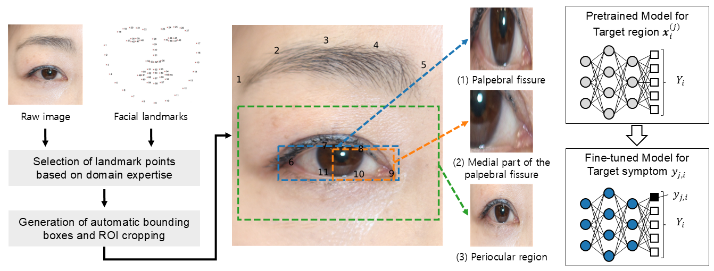

# TAOD-Net: Automated Detection and Analysis of Thyroid-Associated Orbitopathy
This repository contains the PyTorch implementation for the paper [TAOD-Net: Automated detection and analysis of thyroid-associated orbitopathy in facial imagery](https://www.sciencedirect.com/science/article/pii/S0360835225001706?via%3Dihub).

> Oh, Y., Koh, G., Kwak, J., Shin, K., Kim, G.S., Lee, M.J., Choung, H., Kim, N., Moon, J.H. and Kim, S. (2025). TAOD-Net: Automated detection and analysis of thyroid-associated orbitopathy in facial imagery. Computers & Industrial Engineering, 111024.

## Overview
TAOD-Net (Thyroid-Associated Orbitopathy Detection Network) is an advanced transformer-based system designed to automate the detection of five key inflammatory signs associated with Thyroid-Associated Orbitopathy (TAO). This model aims to standardize and improve TAO diagnosis using patient facial images.

The approach leverages:
- **Domain-knowledge-based image cropping** to improve diagnostic accuracy.
- **Multi-label classification** to detect signs linked to the Clinical Activity Score (CAS).
- **Vision Transformers (ViTs)** for state-of-the-art performance in medical image classification.



## Features
- Detects five inflammatory signs linked to CAS:
  1. Redness of Eyelids (RE)
  2. Redness of Conjunctiva (RC)
  3. Swelling of Eyelids (SE)
  4. Inflammation of the Caruncle (IC)
  5. Conjunctival Edema (CE)
- Two-stage training strategy combining pretraining and fine-tuning with a novel loss function.
- Incorporates domain knowledge to identify key regions in facial images.
- Validated on 2,040 facial images from 1,020 TAO patients.

## Directory Structure
- `src/`
  - `losses.py`: Defines custom loss functions.
  - `model.py`: Implements the TAOD-Net architecture.
  - `utils.py`: Utility functions for data preprocessing and model operations.
- `experiments/`
  - `binary.py`: Conducts baseline method for multi-label classification.
  - `pretraining.py`: Handles the pretraining phase of TAOD-Net with multi-label loss.
  - `model_run.py`: Script for training, validating, and testing the TAOD-Net model and benchmarks.

## Usage
### Baseline
```bash
python binary.py --base 'ViT' --mode 0 --symptom 0
python binary.py --base 'ViT' --mode 1 --symptom 0
```

### Pretraining
```bash
python pretraining.py --base 'ViT' --mode 0 
python pretraining.py --base 'ViT' --mode 1 
```

### Training and Evaluation
```bash
# combined
python model_run.py --setting 'combined' --base 'ViT' --loss 'CAUCM' --symptom 0 --domain 
python model_run.py --setting 'combined' --base 'ViT' --loss 'CAUCM' --symptom 0 --no-domain

# multi
python model_run.py --setting 'multi' --base 'ViT' --loss 'CAUCM' --symptom 0 --domain 
python model_run.py --setting 'multi' --base 'ViT' --loss 'CAUCM' --symptom 0 --no-domain 

# binary
python model_run.py --setting 'binary' --base 'ViT' --loss 'CAUCM' --symptom 0 --domain 
python model_run.py --setting 'binary' --base 'ViT' --loss 'CAUCM' --symptom 0 --no-domain     
```

## Dataset
- The dataset comprises 2,040 facial images of TAO patients.
- Ethical approval and anonymization processes were adhered to for data privacy.
- Preprocessed images are automatically cropped based on anatomical landmarks.

## Ethic Statement
We wish to appreciate to Thyroscope Inc. and Seoul National University Bundang Hospital (SNUBH) for their generous provision of data access and the extension of the Institutional Review Board (IRB) license to our research team. This study received approval from the SNUBH Institutional Review Board (IRB\# B-2109-709-101). Additionally, the requirement for informed consent was exempted by the same board, given that the study's methodology primarily involved a retrospective analysis of medical records and pre-collected facial images. 
All experiments were conducted in compliance with relevant guidelines and regulations. Prior to external transfer, all images and clinical data were meticulously anonymized to ensure privacy protection. Furthermore, the procedure for data transfer received authorization from the SNUBH Data Review Board (DRB\# 2021-02-01).

## Citation
If you use TAOD-Net in your research, please cite:
```bibtex
@article{oh2025taod,
  title={TAOD-Net: Automated detection and analysis of thyroid-associated orbitopathy in facial imagery},
  author={Oh, YongKyung and Koh, Giheon and Kwak, Jiin and Shin, Kyubo and Kim, Gi-Soo and Lee, Min Joung and Choung, Hokyung and Kim, Namju and Moon, Jae Hoon and Kim, Sungil},
  journal={Computers \& Industrial Engineering},
  pages={111024},
  year={2025},
  publisher={Elsevier}
}
```
